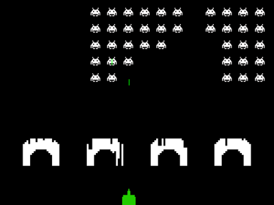

# Space invaders



In this project I am using the `pygame` package to rebuild the classic 1978 Space invaders game. As this is my first attempt of building a computer game, the project serves mainly as an opportunity to learn new concepts about game development while incorporating software design patterns that try to keep the code as clean as possible. The following text serves to give an overview of the most important components that make up this project.

# Usage
Currently the only way to execute the program is via the `main.py` script in the space_invaders root folder. 

# Future Milestones
- &#9745; Create a score system and scoreboard
- &#9745; Create custom *openai* `gymnasium` environment for Reinforcement Learning
- &#9744; Publish project to Pip

# Overview

## Pygame
The most unfamiliar concept for me in this project was probably the fundamentals of game development. The pygame package is a natural choice for newcomers in game development in python, because it leaves almost all design choices to the user which has made it possible to experiment with a lot of different ideas in the process of creating this game.
Here are some important things I learned about [pygame](https://www.pygame.org/docs/) and game development in general:
- Like all graphical programs programs using pygame rely on an event loop that runs as long as the game is not finished and checks for user input at each iteration
- Its purpose is to update the positions of all displayed objects and process all game logic between displayed frames
- Pygame comes with some very handy classes like `pygame.sprite.Sprite` and `pygame.sprite.Group` which allow efficient control over many visible objects at same time (More detail of how I used them in class infos). 

### Moving an object
An object is represented as an image, which is nothing more than a rectangle of pixels. In game development the term ***sprite*** refers to every visible oject in the game. Moving a sprite requires tracking its current position, deleting it from the current position (and inserting the background at that position) from the screen and drawing the object again at an altered position. Roughly speaking this is what is meant with the term *blitting*. [Here](https://www.pygame.org/docs/tut/MoveIt.html) is more information about how to move an object efficiently in pygame.

## Class BaseObject
- Defines the interface for all visible objects in the game
- Inherits from `pygame.sprite.Sprite` which is a base class for all visible objects in pygame
- Its most important features come to shine when working with `pygame.sprite.Group` instances - the latter can be used as control classes that represent groups that sprite objects can be assigned to 
Important Methods:
 - rescale(self, size): rescale the objects image to a new specified size 

### Concrete implemented classes
- `Player`: A class for the user controlled object in the game
- `Enemy`: Non player objects that have a deterministic movement
- `Laser`: A single laser that can move vertically either in the direction of the top screen boundary (if shot by the player) or in the direction of the bottom of the screen (when shot by Enemy instances)
- `Blockade`: A single square shaped block that is used to build up a larger structure which can be used by the player as cover for incoming laser shots. Enemy lasers and player lasers destroy blockade structures upon contact.

## Controller classes
For this project I chose to seperate different responsibilities of the program into different parts. The aforementioned classes that inherit from `BaseClass` store the initial state of the system (by keeping track of their positions, speeds, etc.). **Control classes** on the other hand are responsible for the execution of the game logic and implement the interactions between objects. By doing so, they effectively modify the current state of the system.

## EnemyController
This control class inherits from `pygame.sprite.Group` and keeps track of all alive enemies in the game. All interactions of `Enemy` objects with the game (like drawing Enemies on screen, shooting lasers, moving enemies) are called by the `EnemyController` that chains method calls onto all tracked `Enemy` instances. When the reference of an `Enemy` object is deleted in the `EnemyController` the enemy vanishes from screen as it is no longer drawn by the `EnemyController`.  The `EnemyController` also keeps track of a `LaserController` instance, which tracks lasers shot by any of the enemies. I decided to make this an attribute of this class instead of an attribute of the enemy class, as all enemies should only be allowed to shoot one laser at a time, so only one instance of `Laser` will ever exist at the same time. 
Important Methods:
- update: move all enemies
- choose random enemy
- shoot laser


## LaserController
Similar to the `EnemyController`, this class inherits from `pygame.sprite.Group` and acts as a controller for Laser instances. Laser objects delete themselves after they leave the visible screen or collide with another object. When this happens the reference to these objects is cleared from the `LaserController` they were assigned to. An `EnemyController` or a `PlayerObject` is only allowed to shoot another laser once their `LaserController` attribute tracks sprites. Hence, the player can only shoot another laser once the last one is not visible any more (like in the original game). 


## BlockadeController
This controller class for blockade objects is mainly used to create the blockade structures at the beginning of the game. It also defines convinience methods for drawing and clearing all blockade sprites from screen.


## GameObjectController
This class keeps track of all other controller classes in the game. Most importantly, it is responsible for all interactions between the player, the enemies and the blockades. It is injected into the `GameHandler` class to control all sprites in the game.


## The GameHandler class
This class manages the evolution of the game by defining the game loop. It checks for user input and updates updates all sprites accordingly via a passed instance of `GameObjectController`. Additionally metrics are tracked such as the game time and the number of killed enemies.

## Configurations
The values of every internal game setting can be modified in the `config.yaml` file in the components folder.

## Gym Environment

I refactored parts of the existing code for the space invaders game to create a backend for an environment that can be accessed by a computer rather than a player. Additionally, I registered the environment to the `Env` API from the popular reinforcement library `gymnasium`. After installing the package, the environment can be simply accessed via an import of `space_invaders`: 
```Python
import space_invaders
import gymnasium

env = gymnasium.make("CustomSpaceInvaders-v0", render_mode="rgb_array")
# Reset environment
env.reset()
# Game loop
terminated = False
while not terminated:
    obs, reward, terminated, False, info = env.step(action=env.action_space.sample())
```
Parameters that can be passed to the `.make()` constructor include:
- width: int = 200
    - The pixel width of the array that is returned as the observable from the `step` method.
- heigth: int = 150
    - The pixel height of the array that is returned as the observable from the `step` method.
- render_mode: Literal["human", "rgb_array", "gray_scale_array"] = "human"
    - Supported render modes are "human", "rgb_array" and "gray_scale_array".
- reward: Optional[dict[Literal["enemy_kill", "player_damage"], int]] = None
    - Specify the amount of reward that the environment returns for hitting an enemy and being hit by the enemy.
